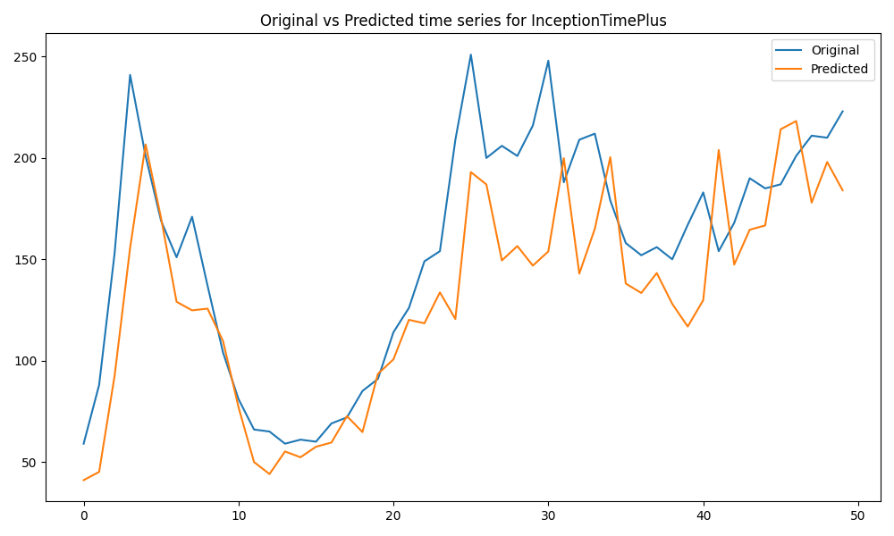
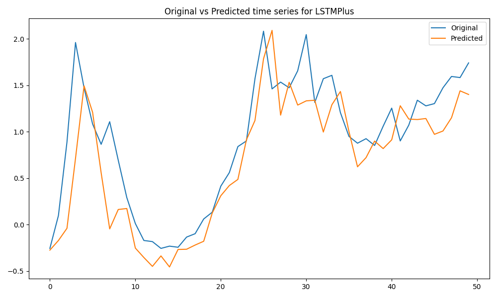
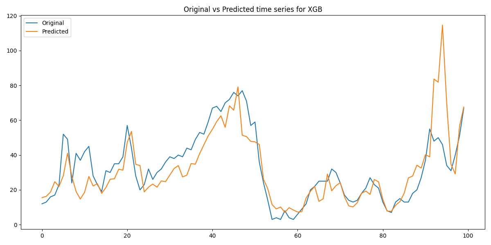

# ForecastFlow: An automated code-base for time-series forecasting 
This repository contains the code for time-series forecasting using various models, such as InceptionTime, LSTM, XGBoost, etc. It contains the complete pipeline from data preprocessing, model building, training, hyperparameter tuning, and evaluation.

MLFlow tracks the experiments and logs the metrics, parameters, and artifacts. Hydra manages configurations, and Optuna optimizes hyperparameters.

The code is designed to be modular and scalable. You can easily add new models, preprocessors, and data loaders!

### Data
The data used in this project is the [Beijing Multi-Site Air Quality](https://archive.ics.uci.edu/dataset/501/beijing+multi+site+air+quality+data) from the UCI Machine Learning Repository. It contains hourly air quality data from 12 different sites in Beijing. The data is preprocessed and aggregated to hourly/daily/weekly data for forecasting purposes.

### Models
The following models are used for forecasting:

- XGBoost
- LSTM
- InceptionTime
- etc.


### Results
The following are the results of the forecasting models:

 - `InceptionTime` with ```hourly``` data, ```past_horizon``` = ```10```, ```forecast_horizon``` = ```1```:



- `LSTM` with ```hourly``` data, ```past_horizon``` = ```10```, `forecast_horizon` = `1`, with Standardized data:



- `XGBoost` with `hourly` data, `past_horizon` = `10`, `forecast_horizon` = `1`:



Different windows were used for forecasting purposes in the case of XGBoost, so the plots are not comparable.

### Requirements
`requirements.yml` contains the required libraries to run the code. You can install them using the following command:
```bash
conda env create -f requirements.yml
```

To update with new libraries:
```bash
conda env export --no-builds | grep -v "prefix" > requirements.yml
```
